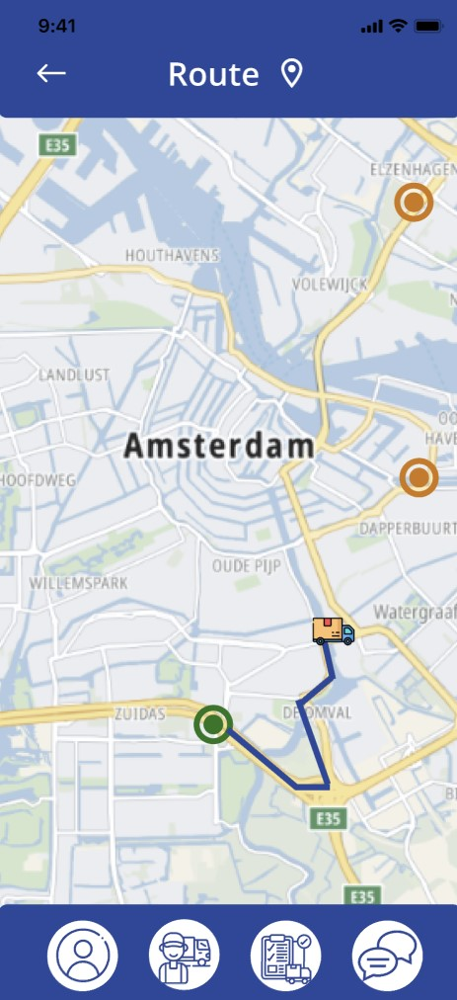

# Welcome to Logify

## About Us

Logify is a comprehensive logistics and communication platform designed to streamline cargo management, real-time communication, and location tracking for drivers and owners. This project leverages modern technologies to provide a robust backend and an intuitive user interface, ensuring efficient performance and seamless functionality.

## Project Description

Logify aims to enhance the efficiency of logistics operations by integrating key features such as user authentication, cargo session management, real-time communication, location tracking, and document management. It supports multiple roles (drivers and owners), providing customized interfaces and functionalities tailored to each role. The platform is built to handle complex logistics workflows, including route creation, document management, and real-time chat with document sharing capabilities.

## Technologies Used

|    Functionality    |   Languages |
|--------------------:|-------------|
| Android application |Kotlin+Jetpack Compose|
| Android application |Dagger+Retrofit|
|   iOS application   |Swift+SwiftUI|
|     Backend API     | C# and .NET |
|       Caching       |    Redis    |
| Storing binary files|   MongoDB   |
|   Structured data   |    MS SQL   |

## Key Features

User Authentication: Secure login and registration for drivers and owners.
Cargo Management: Create, track, and manage cargo sessions with detailed route planning.
Real-time Communication: Chat functionality with document sharing and phone call redirection.
Location Tracking: Integrated GPS tracking and Wialon API for real-time location updates.
Document Management: Upload, delete, and view documents related to cargo sessions.
Profile Management: Customizable profile settings for drivers and owners.
Map Functionality: Real-time location tracking and route display for drivers and owners

## License

This project is licensed under the Apache License 2.0.

## How it will look like

[Link to full design on Figma](https://www.figma.com/design/ii1N9CcCTpyrmEf3JUpfv0/Logistics?node-id=0-1&t=DT3O4Zk6lU830CUZ-0)

### Login and Register

### Route

### Cargos

### Profile

 

### iOS version

`Cargo`

 
 

`Chat`

 
 

`Profile`

